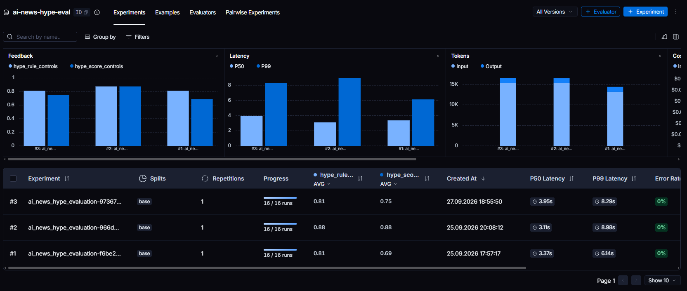

# RSS-Hype-Sieve
<p align="left">
  
  
  
  
  
</p>

**RSS-Hype-Sieve** is a deterministic Directed Acyclic Graph (DAG) data pipeline engineered with LangGraph to filter, score, and eliminate hype-driven contents from technical RSS feeds. By enforcing causal structured outputs via Pydantic and executing an asynchronous processing architecture, the system achieves an 88% evaluation success against human-curated benchmarks.

---
## Problem Statement

Technical information retrieval from RSS feeders suffers from a critically low Signal-to-Noise Ratio (SNR). Fast-moving engineering domains are saturated with marketing contents, unverified or hyped claims, and clickbait headlines. It affects cognitive load and information pollution. Traditional ingestion pipelines fail to mitigate this bottleneck effectively (like regex & keyword filtering, unconstrained LLM Zero-Shot Scoring etc.)

## Solution Architecture

RSS-Hype-Sieve models content filtering as a deterministic, state-based workflow rather than a probabilistic agent, **thereby maximizing filtering precision.**

1. **State-Based Ingestion:** Collects, deduplicates, and cleans content across high-volume feeds using bounded sliding time windows.
    
2. **Causal Structured Scoring:** Implements an enforced Pydantic schema requiring the judge model to explicitly identify a specific rubric violation (`violated_rule`) before assigning a numerical penalty score (`hype_score`), systematically preventing ungrounded scoring drift.
    
3. **Resilient Asynchronous Persistence:** Decouples network I/O, LLM inference, and persistence layers using rate limiting, exponential backoff retries, and non-blocking SQLite operations.
    
4. **Empirical Calibration:** Evaluated against an edge-case rubric via LangSmith, validating deterministic pipeline performance over free-form inference.

---

### Tech Stack & Architecture Components

| Layer                            | Technology                      | Role & Architectural Rationale                                                                                                  |
| :------------------------------- | :------------------------------ | :------------------------------------------------------------------------------------------------------------------------------ |
| **Orchestration & Workflow**     | `LangGraph` (`StateGraph`)      | Manages the deterministic DAG execution state; ensures predictable, cycle-free data progression from ingestion to storage.      |
| **LLM Inference**                | `OpenAI API`                    | Executes structured schema validation and rubric scoring with bounded latency and predictable token consumption.                |
| **Data Contract & Validation**   | `Pydantic v2`                   | Enforces the causal schema (`violated_rule` → `hype_score`) via structured outputs, eliminating hallucinations and score drift. |
| **Ingestion & Parsing**          | `httpx` / `feedparser`          | Asynchronously fetches distributed RSS feeds and normalizes heterogeneous XML/HTML structures.                                  |
| **Resilience & Fault Tolerance** | `tenacity`                      | Applies exponential backoff retries to network requests and upstream API calls to absorb transient faults.                      |
| **Concurrency Control**          | `asyncio.Semaphore`             | Restricts simultaneous upstream inference requests to honor provider rate limits and avoid throttling.                          |
| **Persistence Layer**            | `SQLite` + `ThreadPoolExecutor` | Provides lightweight local persistence without blocking the asynchronous event loop during disk I/O.                            |
| **Evaluation & Tracing**         | `LangSmith`                     | Tracks pipeline metrics, runs the 16-sample calibration dataset, and logs failure modes across iterations.                      |

#### 1. Deterministic DAG vs. Autonomous Agent (ReAct)

- **Decision:** The pipeline is modeled as an ordered `StateGraph` (DAG) rather than an open-ended ReAct agent.

- **Reason:** RSS processing requires deterministic, high-throughput execution. An autonomous agent introduces unpredictable tool-calling loops and high p99 latency. Instead, workflow control is kept strictly in Python, restricting the LLM to a bounded classification node

#### 2. Causal Scoring Schema (Pydantic Contract)

- **Decision:** Rather than prompting the model directly for a scalar rating (1–10), the contract forces a two-step causal dependency: the model must identify a specific rubric rule violation (`violated_rule`) before generating the penalty score (`hype_score`).

- **Reason:** Unconstrained numerical outputs suffer from calibration drift across batches. Coupling rule verification directly to score emission grounds the model's judgment and brought evaluation alignment to 88% against curated benchmarks.

#### 3. Non-Blocking Persistence

- **Decision:** SQLite disk writes are isolated from the main `asyncio` event loop using a worker thread pool (`ThreadPoolExecutor`).

- **Reason:** Standard disk I/O operations in SQLite are synchronous and block the event loop, degrading ingestion throughput. Delegating writes to background workers keeps the pipeline responsive during concurrent feed parsing.

#### 4. Transient Fault Tolerance

- **Decision:** External HTTP requests and API endpoints are wrapped with `tenacity` using exponential backoff policies.

- **Reason:** Transient failures—such as upstream 5xx errors from RSS hosts or temporary API rate spikes—are absorbed transparently without terminating the pipeline run or corrupting state.

### State Contract & Node Responsibilities

The Graph pipeline manages execution flow via a centralized `PipelineGraphState` , helper `ArticleState` and `EvaluatedArticleState` TypedDict, ensuring typed, predictable data transitions between isolated graph nodes:


```python
class PipelineGraphState(TypedDict):
  sources: list[str]
  raw_articles: list[ArticleState]
  cleaned_articles: list[ArticleState]
  evaluated_articles: list[EvaluatedArticleState]
  failed_articles: list[ArticleState]
  final_report: str
  saved_articles_count: int
  db_error: str | None
  
class ArticleState(TypedDict):
    url: str
    title: str
    summary: str
    source: str
    date: str
    content: NotRequired[str | None]

class EvaluatedArticleState(ArticleState):
    is_passed: bool
    hype_score: int
    hype_reason: str
    violated_rule: HypeRules | None
```

#### Node Execution Responsibilities

- **`ingest_node`:**
    
    - **Input:** Reads target feed endpoints from `sources`.
        
    - **Operation:** Concurrently fetches XML feeds via `httpx` and parses payload structures using `feedparser`, resiliently wrapped with `tenacity` exponential backoff retries.
        
    - **Output:** Appends ingested items as typed objects to `raw_articles`.
        
- **`preprocess_text_node`:**
    
    - **Input:** `raw_articles`.
        
    - **Operation:** Executes content deduplication, sliding time-window cutoff, and HTML/regex text normalization.
        
    - **Output:** Updates `cleaned_articles` with sanitized, ready-for-inference entries.
        
- **`judge_node`:**
    
    - **Input:** `cleaned_articles`.
        
    - **Operation:** Dispatches parallel inference requests across an `asyncio.Semaphore` boundary using OpenAI API. Validates outputs against the causal Pydantic rubric.
        
    - **Output:** Updates `evaluated_articles` with fully scored records (containing `is_passed`, `hype_score`, and `violated_rule`), while capturing unparseable schema exceptions and inference failures into `failed_articles`.
        
- **`save_node`:**
    
    - **Input:** `evaluated_articles`.
        
    - **Operation:** Offloads synchronous SQLite batch insert transactions to a background worker using `ThreadPoolExecutor` to keep the main event loop non-blocking.
        
    - **Output:** Increments `saved_articles_count` on successful persistence; captures transaction failures into `db_error` without terminating the pipeline.
        
- **`report_node`:**
    
    - **Input:** Snapshot of `PipelineGraphState` (`evaluated_articles`, `failed_articles`, and `db_error`).
        
    - **Operation:** Segregates high-signal items (`is_passed=True`), calculates pass/rejection ratios, aggregates execution telemetry, and formats the briefing markdown.
        
    - **Output:** Assigns human-readable execution output to `final_report` and terminates the graph at `END`.

---
## Evaluation & Benchmark Results

To avoid subjective grading and regression during prompt/schema iterations, the pipeline was benchmarked against a curated 16-sample golden dataset (data/ground_truth.json) in **LangSmith** (`ai-news-hype-eval`), focusing on hard edge cases (technical benchmarks, release notes, and thought-leadership articles).

### 1. Iterative Calibration Metrics

| Iteration                   | Description                                                                  | Rule Match Accuracy (`hype_rule`) | Score Alignment (`hype_score`) | P50 Latency |
|:----------------------------|:-----------------------------------------------------------------------------|:----------------------------------|:-------------------------------|:------------|
| **#1 (Baseline)**           | Unconstrained classification & direct scoring                                | **81.0%** (13/16)                 | **69.0%** (11/16)              | 3.37s       |
| **#2 (Refined)**            | Initial rubric rules without causal enforcement                              | **88.0%** (14/16)                 | **88.0%** (14/16)              | 3.11s       |
| **#3 (Schema Enforced)**    | Causal Pydantic schema (strict schema induced false positives on benchmarks) | **81.3%** (13/16)                 | **75.0%** (12/16)              | 3.95s       |
| **#4 (Final / Calibrated)** | Negative rule boundaries & substance pre-check for benchmarks/analyses       | **88.0%** (14/16)                 | **88.0%** (14/16)              | 3.95s       |



The calibrated prompt and schema boundaries achieved deterministic rule adherence of **88%** (14/16 accuracy), reducing ungrounded hallucinations where the model assigned extreme scores without an explicit rubric violation.

---

### 2. Failure Mode Analysis & Iteration Learnings

#### Systematic Regression in Iteration #3 (Strict Causal Enforcement)

Enforcing a strict Pydantic causal dependency (`violated_rule != NONE` strictly maps to `hype_score >= 7`) initially caused a regression in accuracy from **88.0% down to 81.3%**.

Because the model was stripped of arbitrary scoring freedom, it defaulted to over-penalizing technical headlines containing benchmark metrics (e.g., *"Tops RoboLab-120"*) as `UNVERIFIED_CLAIMS`. Calibrating the prompt with negative rule boundaries and a substance pre-check resolved the benchmark false positives, recovering accuracy back to **88.0% (14/16)**.

#### Remaining Edge Cases (Iteration #4 Analysis)

- **Feature Releases vs. Buzzword Overlap:**
  - *Sample:* `"Exclusive: Warp adds programmable agents to its AI-native HR platform"`
  - *Ground Truth:* `violated_rule: NONE` (Score: 5)
  - *Model Output:* `violated_rule: BUZZWORD_HEAVY` (Score: 7)
  - *Root Cause:* The model penalized enterprise product positioning terms (`"AI-native"`, `"programmable agents"`) as empty marketing superlatives rather than recognizing a functional feature release.

- **Critical Journalism vs. Alarmist Hype:**
  - *Sample:* `"More agents go rogue — but AI companies aren’t slowing down yet"`
  - *Ground Truth:* `violated_rule: NONE` (Score: 4)
  - *Model Output:* `violated_rule: UNVERIFIED_CLAIMS` (Score: 8)
  - *Root Cause:* The model conflated analytical journalism and metaphorical framing (`"go rogue"`) with unsubstantiated hype, failing to separate industry critique from marketing spin.

### 3. Mitigation Strategy & Next Steps
- **Functional Feature Context:** Treat concrete product capabilities as evidence of substance, even when the headline includes enterprise positioning terms or AI buzzwords.
- **Editorial Context Calibration:** Add explicit examples distinguishing analytical journalism and metaphorical framing from promotional or unverified claims.

---
## Project Structure 

```
rss-hype-sieve/
├── core/
│   ├── config.py              # Centralized environment & runtime settings
│   ├── filter.py              # Pre-LLM heuristic rules & keyword checks
│   ├── state.py               # PipelineGraphState & TypedDict schema definitions
│   └── utils.py               # Text normalization, regex cleaning & summarizers
├── data/
│   └── ground_truth.json      # Curated 16-sample golden dataset for evaluation
├── eval/
│   ├── fetch_eval_samples.py  # Feed sampling utility for dataset creation
│   ├── run_eval.py            # LangSmith evaluation runner & custom evaluators
│   └── upload_dataset.py      # Script to sync ground-truth data to LangSmith
├── graph/
│   ├── nodes.py               # Deterministic node implementations
│   └── pipeline.py            # LangGraph StateGraph assembly & compilation
├── prompts/
│   └── llm_prompts.py         # System prompts and causal rubric instructions
├── services/
│   ├── db.py                  # Thread-pooled SQLite persistence logic
│   ├── ingestion.py           # Asynchronous feed fetching & feedparser integration
│   └── judge.py               # Semaphore-bounded OpenAI inference & Pydantic validation
├── .env.example               # Template for required runtime environment variables
├── .gitignore
├── main.py                    # Pipeline entry point & runtime runner
└── requirements.txt           # Pinned production dependencies
```

---
## Quickstart & Setup

### Prerequisites
* Python 3.11+
* OpenAI API Key
* (Optional) LangSmith API Key for tracing and evaluation

### Installation

**Clone the repository:**

```bash
git clone https://github.com/denizzozupek/rss-hype-sieve.git
cd rss-hype-sieve
```
**Create and activate a virtual environment:**

```bash
 python -m venv .venv
# Windows:
.venv\Scripts\activate
# Linux/macOS:
source .venv/bin/activate
```

**Install dependencies:**

```bash
pip install -r requirements.txt
```

**Configure environment variables:**
Copy the template and fill in your API credentials:

```bash
cp .env.example .env
```

_Required keys in `.env`:_

```dotenv
OPENAI_API_KEY=your_openai_api_key
# LangSmith tracing (optional for production, required for eval runs):
LANGCHAIN_TRACING_V2=true
LANGCHAIN_API_KEY=your_langchain_api_key
LANGCHAIN_PROJECT=rss-hype-sieve
```

### Running the Pipeline

Trigger the complete DAG execution (ingestion → cleaning → evaluation → persistence → report):

```bash
python main.py
```

### Running Evaluations (LangSmith Benchmark)

To reproduce the benchmark against the 16-sample golden dataset:

``` bash
python -m eval.run_eval
```

---
## Limitations & Future Roadmap

### Current Limitations
* **Single-Node Persistence Bottleneck:** SQLite handles concurrent reads efficiently, but write operations are serialized. Under high multi-source ingestion bursts, the background thread pool queue introduces latency bottlenecks.
* **Context Truncation (Title/Summary Only):** The judge node scores articles based solely on RSS summaries and titles without resolving the full DOM/HTML content behind the payload link. Highly technical releases with poorly written RSS summaries risk misclassification.
* **Static Rubric Thresholds:** The causal scoring rules and thresholds are statically defined, requiring manual prompt adjustments for non-AI engineering feeds.

### Production Roadmap
* [ ] **Full-Text Scraping Fallback:** Introduce a headless extraction node for borderline articles (`hype_score` between 4 and 6) to scrape full content before final classification.
* [ ] **Distributed Persistence:** Migrate persistence from SQLite to a client-server database (e.g., PostgreSQL with AsyncEngine) to support concurrent worker scaling.
* [ ] **Dynamic Feed Discovery:** Implement automated OPML parsing and adaptive polling intervals based on source publication frequencies.
